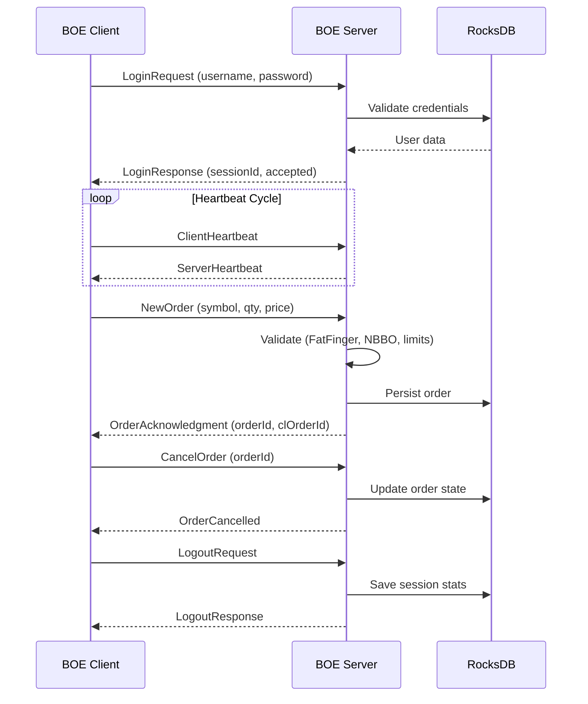

# 💹 TitaniumBOE-Sim

> **A high-fidelity Java simulator for the Cboe Titanium U.S. Options Binary Order Entry (BOE) protocol**

[](https://openjdk.org/)
[](https://maven.apache.org/)
[](LICENSE)
[](https://rocksdb.org/)

---

## 📖 Overview

**TitaniumBOE-Sim** is a comprehensive, production-grade simulator of the **Cboe Titanium BOE protocol**, built entirely in Java. This project replicates the complete client-server communication flow for options trading, featuring binary message serialization, session management, order lifecycle handling, and persistent storage.

Perfect for:
- 📚 Learning binary financial protocols
- 🧪 Testing trading systems without live market connections
- 🎓 Educational demonstrations of low-latency trading infrastructure
- 💼 Portfolio showcasing of financial systems development

> ⚠️ **Disclaimer**: This is a **simulator for educational purposes only**. It does not connect to real Cboe systems or execute actual trades.

---

## ✨ Key Features

### 🔌 Protocol Implementation
- ✅ **Full BOE message suite**: Login, Logout, Heartbeat, NewOrder, CancelOrder, OrderAck, OrderRejected
- ✅ **Binary serialization/deserialization** (Little Endian, network byte order)
- ✅ **Session state management** with automatic recovery
- ✅ **Bidirectional heartbeat mechanism** with timeout detection

### 🏗️ Server Architecture
- 🔐 **Authentication system** with BCrypt password hashing
- 📊 **Order management** with state machine validation
- 🗄️ **RocksDB persistence** for sessions, orders, and statistics
- ⚡ **Rate limiting** to prevent message flooding
- 📈 **Health metrics** and performance monitoring
- 🛡️ **Order validation**: Fat Finger checks, NBBO compliance, quantity limits
- 🔄 **Concurrent session handling** with thread-safe operations

### 💻 Client Architecture
- 🔁 **Automatic reconnection** with exponential backoff
- 💓 **Heartbeat management** with server monitoring
- 📡 **Asynchronous message listeners**
- 📝 **Comprehensive logging** (hexadecimal + decoded format)
- 🎯 **Session event hooks** for integration

### 🛠️ Engineering Highlights
- 🧵 **Multi-threaded design** with ExecutorService pools
- 🔒 **Thread-safe concurrent collections**
- 📦 **Repository pattern** for data access
- 🎨 **Clean separation of concerns** (protocol, persistence, business logic)
- ✅ **Comprehensive test coverage** (JUnit 5 + Mockito)

---

## 🏛️ Architecture

```
┌─────────────────┐                      ┌─────────────────┐
│   BOE Client    │◄────TCP/IP BOE───────►│   BOE Server    │
│                 │    Binary Protocol    │                 │
├─────────────────┤                       ├─────────────────┤
│ • Connection    │                       │ • Auth Service  │
│ • Heartbeat     │                       │ • Session Mgr   │
│ • Session Mgr   │                       │ • Order Mgr     │
│ • Reconnect     │                       │ • Validator     │
│ • Listeners     │                       │ • Rate Limiter  │
└─────────────────┘                       └────────┬────────┘
                                                   │
                                          ┌────────▼────────┐
                                          │    RocksDB      │
                                          ├─────────────────┤
                                          │ • Sessions      │
                                          │ • Orders        │
                                          │ • Statistics    │
                                          │ • Users         │
                                          └─────────────────┘
```

### 📨 Message Flow



---

## 🚀 Getting Started

### Prerequisites

- **Java 21** or higher ([OpenJDK](https://openjdk.org/) recommended)
- **Maven 3.8+** for dependency management
- **Git** for cloning the repository

### Installation

```bash
# Clone the repository
git clone https://github.com/YOUR_USERNAME/TitaniumBOE-Sim.git
cd TitaniumBOE-Sim

# Compile the project
mvn clean compile

# Run tests
mvn test

# Package as executable JAR
mvn clean package
```

---

## 🎯 Usage

### Running the Server

```bash
# Using Maven
mvn exec:java -Dexec.mainClass="com.boe.simulator.server.CboeServer"

# Using packaged JAR
java -jar target/boe-simulator-1.0-SNAPSHOT.jar
```

**Server Configuration** (edit before running):
```java
// src/main/java/com/boe/simulator/server/config/ServerConfiguration.java
- Port: 9001
- Max Connections: 100
- Heartbeat Timeout: 30s
- Rate Limit: 100 msg/sec
```

### Running the Client

```java
BoeClientConfiguration config = new BoeClientConfiguration.Builder()
    .withHost("localhost")
    .withPort(9001)
    .withUsername("trader01")
    .withPassword("secure123")
    .withHeartbeatInterval(10)
    .build();

BoeClient client = new BoeClient(config);
client.connect();

// Send a new order
client.sendNewOrder("AAPL", 100, 15000); // symbol, qty, price (in cents)

// Cancel an order
client.cancelOrder(orderId);

// Graceful shutdown
client.disconnect();
```

---

## 📁 Project Structure

```
TitaniumBOE-Sim/
├── src/main/java/com/boe/simulator/
│   ├── client/                     # BOE Client implementation
│   │   ├── BoeClient.java          # Main client class
│   │   ├── config/                 # Client configuration
│   │   ├── connection/             # TCP connection handler
│   │   ├── heartbeat/              # Heartbeat management
│   │   ├── listener/               # Message event listeners
│   │   ├── persistence/            # Client-side persistence
│   │   └── session/                # Session state management
│   │
│   ├── server/                     # BOE Server implementation
│   │   ├── CboeServer.java         # Main server class
│   │   ├── auth/                   # Authentication service
│   │   ├── config/                 # Server configuration
│   │   ├── connection/             # Client connection handler
│   │   ├── error/                  # Error handling
│   │   ├── heartbeat/              # Heartbeat monitoring
│   │   ├── metrics/                # Performance metrics
│   │   ├── order/                  # Order lifecycle management
│   │   ├── persistence/            # RocksDB repositories
│   │   ├── ratelimit/              # Rate limiting
│   │   ├── session/                # Session management
│   │   └── validation/             # Order validation rules
│   │
│   ├── protocol/                   # BOE Protocol specification
│   │   ├── message/                # Message definitions
│   │   │   ├── LoginRequestMessage.java
│   │   │   ├── NewOrderMessage.java
│   │   │   ├── OrderAcknowledgmentMessage.java
│   │   │   └── ...
│   │   ├── serialization/          # Binary serialization
│   │   └── types/                  # Custom types (BinaryPrice)
│   │
│   └── util/                       # Utilities
│
├── src/test/java/                  # JUnit 5 tests
├── docs/                           # Documentation
│   ├── BOE Protocol Specification - Quick Reference.md
│   └── US_Options_BOE_Specification.pdf
├── data/                           # RocksDB storage (gitignored)
├── pom.xml                         # Maven configuration
└── README.md
```

---

## 🧪 Testing

The project includes comprehensive tests using **JUnit 5**, **Mockito**, and **Awaitility**:

```bash
# Run all tests
mvn test

# Run with coverage
mvn clean test jacoco:report

# Run specific test class
mvn test -Dtest=OrderManagerTest
```

**Test coverage includes**:
- ✅ Message serialization/deserialization
- ✅ Session state transitions
- ✅ Order validation logic
- ✅ Heartbeat timeout detection
- ✅ Reconnection mechanisms
- ✅ Concurrent client handling

---

## 📊 Protocol Message Reference

| Message Type | Direction | Purpose |
|-------------|-----------|---------|
| `LoginRequest` | Client → Server | Authenticate user session |
| `LoginResponse` | Server → Client | Session acceptance/rejection |
| `ClientHeartbeat` | Client → Server | Keep-alive signal |
| `ServerHeartbeat` | Server → Client | Server liveness confirmation |
| `NewOrder` | Client → Server | Submit new order |
| `OrderAcknowledgment` | Server → Client | Order accepted |
| `OrderRejected` | Server → Client | Order validation failed |
| `CancelOrder` | Client → Server | Cancel existing order |
| `OrderCancelled` | Server → Client | Cancel confirmation |
| `LogoutRequest` | Client → Server | Terminate session |
| `LogoutResponse` | Server → Client | Logout confirmation |

---

## 🔧 Technologies Used

| Category | Technology | Purpose |
|----------|-----------|---------|
| **Language** | Java 21 | Core development |
| **Build Tool** | Maven 3.11 | Dependency management |
| **Database** | RocksDB 8.5.3 | Embedded key-value storage |
| **Serialization** | Jackson 2.15.2 | JSON for configuration |
| **Security** | jBCrypt 0.4 | Password hashing |
| **Testing** | JUnit 5 + Mockito | Unit & integration tests |
| **Async Testing** | Awaitility 4.2 | Testing async operations |

---

## 🛡️ Validation Features

The server implements several safety checks:

### Fat Finger Protection
Rejects orders with unrealistic prices (e.g., AAPL at $50,000):
```java
if (price > MAX_REASONABLE_PRICE) {
    return OrderRejectedMessage(reason: "Fat Finger");
}
```

### NBBO Compliance
Validates against National Best Bid/Offer:
```java
if (buyPrice > nbboAsk || sellPrice < nbboBid) {
    return OrderRejectedMessage(reason: "NBBO violation");
}
```

### Quantity Limits
Enforces maximum order sizes per symbol.

---

## 📈 Metrics & Monitoring

The server tracks:
- 📊 **Active sessions** count
- 📨 **Messages per second** by type
- ⏱️ **Average order latency**
- 🚫 **Rejection rate** by reason
- 💓 **Heartbeat health** status

Access metrics programmatically:
```java
HealthMetrics metrics = server.getHealthMetrics();
System.out.println("Active sessions: " + metrics.getActiveSessions());
System.out.println("Orders/sec: " + metrics.getOrdersPerSecond());
```

---

## 🗺️ Roadmap

Future enhancements planned:
- [ ] 🌐 **REST API** with Spring Boot for remote management
- [ ] 📡 **WebSocket** streaming for real-time order feed
- [ ] 📊 **Prometheus metrics** exporter
- [ ] 🎨 **Web dashboard** (Astro + React)
- [ ] 🧪 **Order book visualization**
- [ ] 📜 **Event sourcing** with replay capability
- [ ] 🖥️ **Interactive CLI** with JLine3

---

## 🤝 Contributing

This is a personal portfolio project, but suggestions are welcome!

1. Fork the repository
2. Create a feature branch (`git checkout -b feature/AmazingFeature`)
3. Commit changes (`git commit -m 'Add AmazingFeature'`)
4. Push to branch (`git push origin feature/AmazingFeature`)
5. Open a Pull Request

---

## 📄 License

This project is licensed under the **MIT License** - see the [LICENSE](LICENSE) file for details.

---

## 🙏 Acknowledgments

- **Cboe Global Markets** for the BOE protocol specification
- **RocksDB** team for the embedded database
- **OpenJDK** community for Java

---

## 📧 Contact

**Project Link**: [https://github.com/YOUR_USERNAME/TitaniumBOE-Sim](https://github.com/YOUR_USERNAME/TitaniumBOE-Sim)

---

<div align="center">

**Built with ☕ and 📈 by [Your Name]**

*If you found this project useful, consider giving it a ⭐!*

</div>